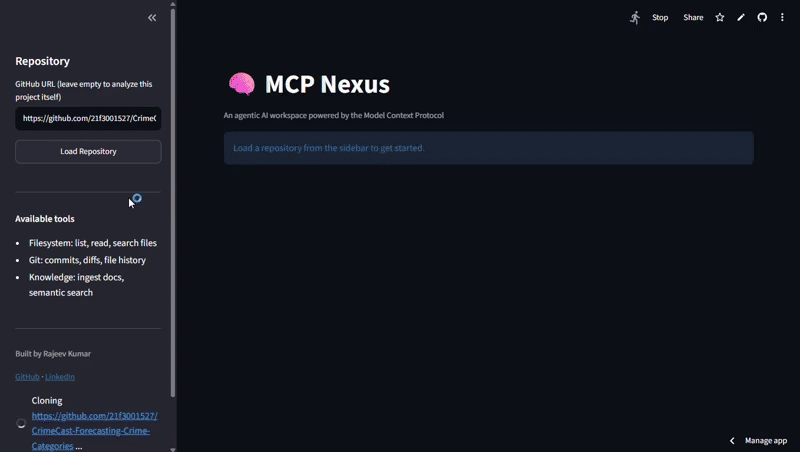
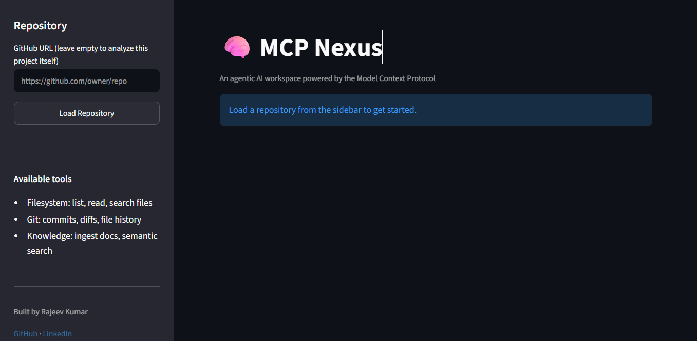
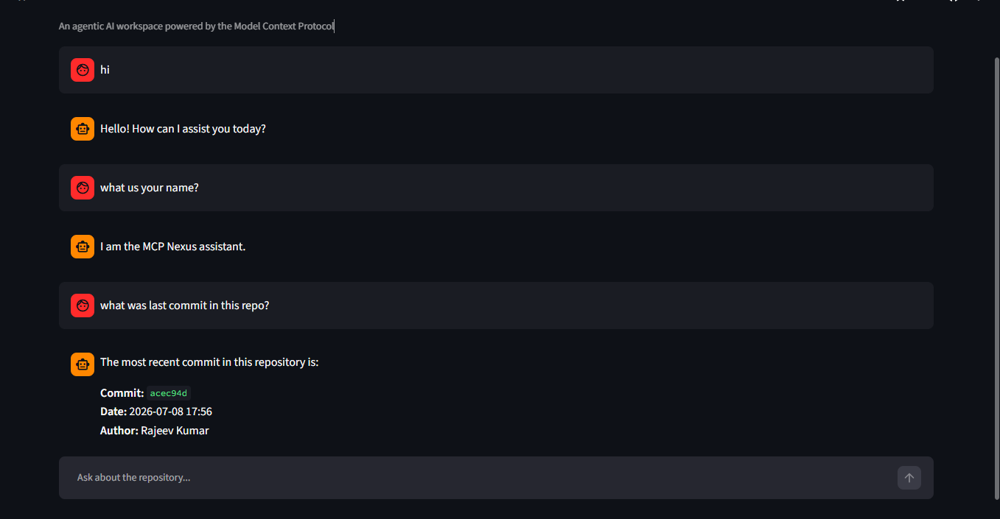

# MCP Nexus

**An Agentic AI Workspace Powered by the Model Context Protocol**

<p align="center">
  
  
  
  
</p>

<p align="center">
  
  
  
  
</p>

<p align="center">
  
  
</p>

<p align="center">
  
  
</p>

<p align="center">
  An AI-powered workspace for understanding software projects through
  <strong>Filesystem, Git, and RAG-powered Knowledge MCP servers</strong>.
</p>

<p align="center">
  🚀 <strong>Live Demo:</strong>
  <a href="https://mcp-nexus-ai.streamlit.app">mcp-nexus-ai.streamlit.app</a>
  &nbsp;•&nbsp;
  <a href="https://github.com/21f3001527/mcp-nexus">GitHub Repository</a>
</p>

<p align="center">
  
</p>

---

## What is MCP Nexus?

MCP Nexus is an **agentic AI workspace for understanding and analyzing software projects** using the **Model Context Protocol (MCP)**.

Instead of relying on a single tool or a fixed retrieval pipeline, MCP Nexus combines three specialized MCP servers under a **LangGraph-based agent**:

- **Filesystem MCP** — explores and searches project files
- **Git MCP** — analyzes commits, diffs, and file history
- **Knowledge MCP** — performs semantic retrieval over project documentation

The agent receives a natural-language question, decides which tools are required, executes those tools, and generates a response grounded in the returned information.

MCP Nexus can work with the **current project** or clone and analyze a **public GitHub repository**.

**Example questions:**

```text
What does this project do?
What changed in the last commit?
How does this function handle errors?
How does the Knowledge server retrieve information?
Which files are responsible for Git operations?
Show me the recent commits in this repository.
```

---

## Key Features

**🤖 Agentic Project Analysis**
- LangGraph-based agent orchestration with dynamic MCP tool selection
- Multi-tool reasoning across sources

**📂 Codebase Intelligence**
- Browse, read, and search project source code
- Understand structure and implementation details

**🌿 Git Intelligence**
- Inspect recent commits, diffs, and file-level history
- Safely handle invalid Git references

**🧠 RAG Knowledge Retrieval**
- Ingest `.md`/`.txt` docs, chunk, embed, and store with FAISS
- Retrieve semantically relevant documentation, rejecting low-confidence results

**🌐 GitHub Repository Support**
- Clone and analyze any public GitHub repository
- Run the same agent workflow against a cloned repo

**🎯 Grounded Responses**
- Answers are based on actual tool outputs, not invented information

---

## Architecture

```
                         ┌──────────────────────┐
                         │        User          │
                         └──────────┬───────────┘
                                    │
                                    ▼
                         ┌──────────────────────┐
                         │     Streamlit UI      │
                         └──────────┬───────────┘
                                    │
                                    ▼
                         ┌──────────────────────┐
                         │   LangGraph Agent     │
                         │    gpt-oss-120b       │
                         │       via Groq        │
                         └──────────┬───────────┘
                                    │
                              MCP Protocol
                                    │
              ┌─────────────────────┼─────────────────────┐
              │                     │                     │
              ▼                     ▼                     ▼
       ┌─────────────┐       ┌─────────────┐       ┌─────────────┐
       │ Filesystem  │       │     Git     │       │  Knowledge  │
       │     MCP     │       │     MCP     │       │     MCP     │
       └──────┬──────┘       └──────┬──────┘       └──────┬──────┘
              │                     │                     │
              ▼                     ▼                     ▼
        Project Files          Git History          FAISS + Docs
```

**Request flow:**

1. The user asks a natural-language question in the Streamlit UI
2. The LangGraph agent decides which MCP tool(s) to call and executes them
3. The agent grounds its answer in the returned tool output before responding

The agent can combine multiple servers when a question needs more than one source.

---

## Screenshots

### Landing Page

<p align="center">
  
</p>

### Repository Analysis

<p align="center">
  
</p>

---

## Tech Stack

| Category | Technology | Purpose |
|---|---|---|
| Language | Python 3.12 | Application development |
| Tool Protocol | FastMCP | MCP server and tool interface |
| Agent Orchestration | LangGraph | Agent state and tool-calling workflow |
| LLM Framework | LangChain | LLM and tool integration |
| LLM Inference | Groq | Fast inference with gpt-oss-120b |
| Embeddings | Sentence Transformers | Local document embeddings |
| Embedding Model | all-MiniLM-L6-v2 | Text representation for semantic search |
| Vector Store | FAISS | Persistent vector similarity search |
| Git Operations | GitPython | Repository and Git analysis |
| UI | Streamlit | Interactive web interface |
| Containerization | Docker | Reproducible deployment |
| Package Management | uv | Python dependency management |

---

## MCP Servers

MCP Nexus uses three specialized MCP servers.

### 1. Filesystem MCP

Provides controlled access to project files.

| Tool | Purpose |
|---|---|
| `list_files` | Explore repository structure |
| `read_file` | Read project files |
| `search_files` | Search for content across files |

Security controls include path validation, sensitive-file blocking, and repository sandboxing.

### 2. Git MCP

Provides Git repository intelligence.

| Tool | Purpose |
|---|---|
| `get_recent_commits` | Inspect recent commits |
| `get_diff` | Analyze repository changes |
| `get_file_history` | Inspect file-level Git history |

Inputs are validated and bounded to prevent unsafe repository operations.

### 3. Knowledge MCP

Provides RAG-based documentation retrieval.

| Tool | Purpose |
|---|---|
| `ingest_docs` | Chunk and index project documentation |
| `query_knowledge` | Retrieve relevant documentation |

**Retrieval pipeline:**

```
Documents → Chunking → Sentence Transformers → Embeddings → FAISS Index → Similarity Search → Relevant Context
```

The current retrieval threshold is **0.35**. Results below this threshold are discarded rather than being treated as reliable evidence.

---

## Quick Start

**Prerequisites:** Python 3.12 · Git · uv · Groq API key

**1. Clone the repository**

```bash
git clone https://github.com/21f3001527/mcp-nexus.git
cd mcp-nexus
```

**2. Install dependencies**

```bash
uv sync
```

**3. Configure environment variables**

Create a `.env` file:

```
GROQ_API_KEY=your_groq_api_key
```

**4. Start the application**

```bash
uv run streamlit run app.py
```

The application will be available at **http://localhost:8501**.

---

## CLI Usage

For debugging without the UI:

```bash
uv run python main.py "What does this project do?"
uv run python main.py "Explain the architecture" --repo /path/to/project
```

For testing the clone → analyze workflow against any public repo:

```bash
uv run python test_clone_agent.py https://github.com/octocat/Hello-World "List the files in this repository"
```

---

## Docker

**Build the image**

```bash
docker build -t mcp-nexus .
```

**Run the container**

```bash
docker run --env-file .env -p 8502:8501 mcp-nexus
```

Open **http://localhost:8502** — the application listens on port 8501 inside the container, mapped to port 8502 on the host.

**The Docker image includes:** Python 3.12, MCP dependencies, LangGraph/LangChain, Sentence Transformers, FAISS, GitPython, Streamlit, and the application source code.

The `.dockerignore` file excludes development-only files such as virtual environments, Git metadata, caches, and generated evaluation results.

---

## Evaluation

MCP Nexus includes two levels of automated testing, run from the command line — evaluation is a development/testing component, not part of the deployed Streamlit UI.

### 1. MCP Server Tests

Verifies that the individual MCP servers behave correctly.

```bash
uv run pytest tests/ -v
```

**Current result:** 21/21 tests passing

### 2. Agent Evaluation

Tests whether the agent uses the available MCP tools correctly — tool selection, filesystem reasoning, Git reasoning, knowledge retrieval, multi-tool workflows, grounding, security boundaries, and unsupported requests.

```bash
uv run python evaluation/run_tests.py
```

**Current evaluation:** 26 scenarios · 24 passed · 2 failed · 92.31% overall

The 2 failures occur because the agent correctly refuses a sensitive-file request before calling the tool the test expected — no data is exposed, but the strict test criteria still marks it as a failure.

**Resumable evaluation** — progress is saved during execution, allowing runs to resume after interruptions such as API rate limits or timeouts.

Results are written to `evaluation/results/latest.json` and `evaluation/results/summary.json`.

---

## Reliability & Security

| Safeguard | Description |
|---|---|
| **Path Security** | Filesystem operations resolve requested paths against the configured project directory and reject paths that escape the allowed workspace |
| **Sensitive File Protection** | Files such as `.env`, `.pem`, and `id_rsa` are blocked from being exposed through filesystem tools |
| **Repository Filtering** | The filesystem server ignores `.git`, `.venv`, `__pycache__`, and `node_modules` |
| **Git Input Validation** | Git operations use bounded inputs and handle invalid references safely |
| **Grounded Responses** | The agent is instructed to base responses on actual tool outputs rather than inventing repository information |
| **Retrieval Confidence** | The Knowledge server applies a similarity threshold before returning retrieved documentation |

---

## Project Structure

```
mcp-nexus/
├── agent/          # LangGraph orchestrator, MCP client, repo utilities
├── servers/        # Filesystem, Git, and Knowledge MCP servers
├── tests/          # MCP server test suite
├── evaluation/     # Agent evaluation runner, scenarios, results
├── data/           # Ingested docs + generated FAISS index (git-ignored)
├── assets/         # README screenshots and demo GIF
├── app.py          # Streamlit app (primary entry point)
├── main.py         # CLI for debugging the agent
├── test_clone_agent.py  # CLI for testing the clone → agent pipeline
├── Dockerfile
├── pyproject.toml
├── LICENSE
└── README.md
```

---

## Known Limitations

- The 0.35 retrieval threshold is heuristic and hasn't been validated at scale
- Agent tool-calling reliability depends on the selected LLM
- Evaluation is CLI-based, not yet integrated into the Streamlit UI

---

## Author

**Rajeev Kumar**
B.S. Data Science and Applications — IIT Madras

<p align="left">
  <a href="https://github.com/21f3001527">GitHub</a>
  &nbsp;•&nbsp;
  <a href="https://linkedin.com/in/rajeev245">LinkedIn</a>
</p>

---

## License

This project is licensed under the [MIT License](LICENSE).